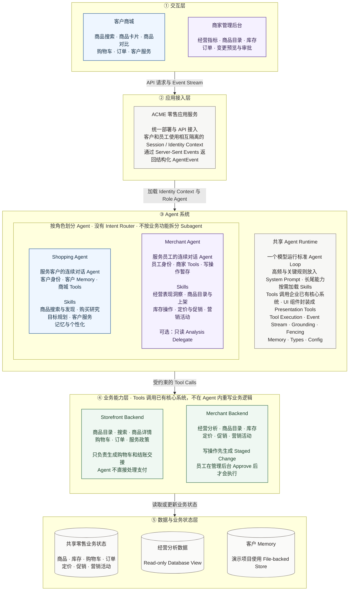
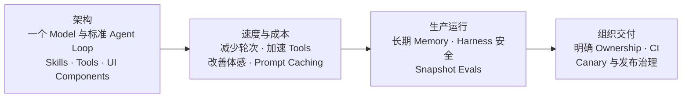

# Claude Commerce Agents 中文本地化说明

这是 Anthropic 开源项目
[`anthropics/commerce-agents`](https://github.com/anthropics/commerce-agents)
的中文本地化派生版本，基于上游提交：

```text
fd4d59224ab96b43c6dc6888207c67b3bd5a24cf
```

原始英文项目说明请查看 [README.md](./README.md)。

## 本地化范围

当前版本重点本地化了零售演示，包括：

- 客户商城与商家管理后台的主要界面文案；
- 商品、订单、活动、商家消息等零售演示数据；
- 商品卡片、商品对比、结账摘要、订单状态等生成式界面组件；
- 商家经营指标、经营摘要、库存、商品目录和订单页面；
- 与中文界面和中文演示数据对应的测试。

Agent、Skills、Tools、Runtime 等代码结构和专业名称保持英文，以便与上游源码、官方文章和开发文档对应。

## 项目架构

> 本图基于 Anthropic 官方文章与 `commerce-agents` 源码整理。主图只呈现 ACME 零售网页演示实际采用的运行路径，不把源码中的替代实现画成同时运行的组件。



## 文章要点全景

以下内容按文章结构提取。它们是文章明确给出的原则、经验或建议；后面的“实现边界说明”才是对参考源码的核对。



### 第一部分：架构

1. **核心架构保持简单**：一个模型运行在标准智能体循环中，通过推理、读取上下文、调用工具、加载技能、追问和观察结果，持续执行到任务完成。
2. **不设置前置意图路由器**：不要先把对话切成不同意图，也不要在主智能体后面为每个业务领域配置一组智能体。
3. **优先使用技能，而不是功能子智能体**：电商对话跨越多个意图和回合，共享购物车、用户偏好和历史上下文；频繁交接会损失状态，并增加令牌消耗与延迟。
4. **子智能体只用于两类例外**：一是可以独立完成、适合单独上下文窗口的窄任务，例如深度研究；二是本身拥有独立合规边界和完整交互职责的专用领域智能体。
5. **区分“委派”与“移交”**：委派时主智能体仍是用户的交互对象；移交后，领域智能体接管对话并独立完成任务。文章不建议在一轮对话中反复来回移交。
6. **系统提示词还是技能，取决于使用频率**：大多数回合都需要的内容放进系统提示词，长尾流程放进技能。文章给出的起点是：覆盖约三分之一以上流量的内容进入系统提示词。
7. **关键规则始终放在系统提示词中**：安全、法律、品牌约束，以及过敏信息等关键用户事实，不应等到技能加载后才出现。
8. **可预测的技能提前注入**：如果能根据用户所在页面等已有信号判断需要哪个技能，应在第一次模型调用前由运行底座直接注入，避免多一次加载回合。
9. **工具建立在企业现有系统之上**：搜索排序、购物车、库存、促销和分析等成熟逻辑继续由原有系统负责；智能体工具负责调用它们，而不是重新实现业务规则。
10. **工具结果就是模型上下文**：只返回模型完成判断所需的字段；对错误也应给出下一步可执行说明，而不是只返回错误码。
11. **界面组件也是工具**：商品卡片、行程、座位图、对比表等应定义为带类型的展示工具。服务端校验和补充数据，再以事件发送给客户端渲染。
12. **不要让模型直接生成自定义界面标签**：随着组件复杂度增加，自定义标签容易格式错误、占用系统提示词，并让历史消息依赖额外解析器。
13. **展示工具保留屏幕上下文**：展示工具参数会保存在消息历史中，因此智能体可以理解“第一个商品”或“左下角第三个选项”。参数顺序必须与最终界面布局一致。

### 第二部分：速度与成本

1. **优先保证结果质量**：文章观察到，任务是否真正完成、答案是否相关，比边际延迟优化更能影响留存、互动和购物车规模。
2. **同时优化真实延迟和体感延迟**：真实延迟来自多个模型回合的生成时间与工具处理时间之和；体感延迟取决于用户多久能看到界面开始变化。
3. **真实延迟只有三个主要杠杆**：减少模型回合、加速工具执行、提高令牌生成速度；目标是降低任务总耗时，而不是孤立优化某一个指标。
4. **提前加载高概率上下文**：从商品页或活动看板打开助手时，把当前页面数据直接放入会话上下文，减少额外查询回合。
5. **独立工具并行调用**：多商品搜索、多政策查询和多数据源分析等彼此独立的操作，应在同一轮并行执行。
6. **不要把缺失的后端逻辑堆进工具层**：如果一个工具内部拼接多个系统并实现复杂领域规则，应优先让上游业务系统提供一个稳定接口。
7. **工具参数完成后立即执行**：不必等待模型输出整个回复；参数完整时即可提前调度工具，慢工具优先发出。
8. **逐步渲染并展示工作进度**：界面组件形成时就发送并渲染；等待工具结果时，用简短自然语言展示当前处理步骤。
9. **提示词缓存按变化频率排序**：全局固定内容放最前，其后是会话级内容，当前时间和当前页面等易变内容放最后，避免破坏缓存前缀。
10. **技能作为工具结果加载**：技能正文进入对话历史后可以随前缀一起缓存，不应每次都重新拼入系统提示词。
11. **文章建议从高缓存命中率设计**：其观察到的成熟电商部署缓存命中率为 90%–99%；缓存断点需要随着对话向前滚动。
12. **模型和推理配置必须通过评测选择**：同时衡量任务质量、延迟和成本。更强模型虽然单个令牌更慢，却可能因为规划更好、回合更少而缩短复杂任务的总时间。
13. **计算每个已完成任务的成本**：不能只看单次模型调用价格；需要更多回合或更容易失败的便宜模型，最终可能更贵。

### 第三部分：生产运行

#### 长期记忆

1. **记忆属于业务系统，不属于模型**：生产环境应把记忆保存为可查询、可治理的结构化数据，而不是依赖模型上下文。
2. **员工记忆按个人而不是商家账户隔离**：共享商家账号下的不同操作员应拥有独立记忆，并遵守各自权限边界。
3. **把记忆当作数据治理问题**：明确允许存储的类型，在写入链路强制校验；允许用户查看、纠正和删除；设置保留期限；支持按部署区域关闭记忆。
4. **异步提取和写入记忆**：在用户对话链路之外，由独立进程从用户与助手文本中提取事实，避免增加交互延迟，也防止商品描述或评论被误记成用户事实。
5. **分三层读取记忆**：少量高频事实始终进入上下文；与当前请求相关的事实每轮预取；其余事实通过查询工具按需获取。

#### 安全

1. **提示词描述安全，运行底座执行安全**：涉及金钱和业务状态的规则必须在代码中强制执行，并由所有运行方式共享。
2. **模型只能提出，人员或策略负责执行**：下单、支付、退款、改价和启动活动都不能由模型工具调用直接完成。
3. **客户侧没有直接扣款接口**：智能体只展示购物车和下单按钮，由真实业务界面完成后续交易。
4. **员工侧写操作先暂存再批准**：每项变更使用服务端生成的编号，只有通过管理后台、命令行确认或平台审批界面批准后才能应用；执行时再次检查最新限制。
5. **写入和界面渲染只接受服务端签发的编号**：模型虚构、用户粘贴或第三方内容植入的对象编号会在进入业务后端前被拒绝。
6. **限制按变更后的最终状态执行**：数量、折扣、调价、补货和预算上限不能只校验单次请求；同一会话的写操作需要串行化，避免并行调用绕过限制。
7. **所有第三方内容统一清洗并隔离**：商品、评论、政策、卖家消息和存储记忆都视为不可信输入；清除控制字符和伪造指令，并限制长度。

#### 评测

1. **评测状态快照，而不是整段模拟对话**：直接构造系统提示词、工具和消息历史组成的状态，再检查最终业务状态和最终渲染结果。
2. **通常评结果，不限制路径**：过度要求智能体必须按固定步骤完成任务，会让测试变得脆弱。
3. **模拟用户适合发现案例，不适合作为主要度量**：两个非确定系统相互作用会提高成本和噪声；发现问题后应将其沉淀为可重复的快照案例。
4. **测试困难和混乱状态**：评测集要包含长历史、多次工具调用、矛盾信息和已有购物车等真实前置条件。
5. **正向案例必须有对应的反向案例**：既测试“应该执行”，也测试“应该拒绝”；既测试“直接做”，也测试“需要追问”。
6. **覆盖五类场景**：核心高频请求、上下文依赖请求、安全与品牌、界面渲染、跨多个能力的组合请求。
7. **业务专家和真实事故共同构建案例**：产品、法务、运营、客服和品类专家都应参与；文章建议每条用户流程以 50–100 个案例作为起点。

#### 大型组织协作

1. **所有权跟随业务系统**：每个技能和工具只有一个负责团队；共享提示词由平台团队管理公共部分，领域团队负责领域部分。
2. **每项变更必须附带评测案例**：包括自身案例、反向案例，以及与相邻技能之间的边界案例。
3. **持续集成运行有针对性的评测集**：始终包含高流量核心案例和全部安全案例，再追加本次改动影响的工具、技能及其相邻边界案例。
4. **完整评测定期运行**：共享提示词变更需要完整评测；完整套件应夜间运行，并在每次发布前执行。
5. **把智能体纳入正式发布治理**：提示词和技能先向小范围用户灰度；技能应能独立关闭；高峰期前像冻结其他核心系统一样冻结智能体变更。

### 展望

1. **稳定资产并不是某个模型版本**：工具连接现有系统，技能沉淀业务流程，评测把产品要求写成测试，运行底座执行政策。更换模型主要是配置变更和一次完整评测。
2. **架构会超越聊天窗口**：同一个智能体可以扩展到语音、主动提醒，以及未来由外部智能体代表用户访问商城。
3. **来源追踪、操作暂存和审批机制是开放能力的前提**：这些机制既约束自有智能体，也能让企业未来安全地向外部智能体开放工具。

## 中文名称与源码对应

| 图中中文名称 | 源码或文章中的名称 |
|---|---|
| 客户商城 | Storefront Web |
| 商家管理后台 | Merchant Portal |
| 购物智能体 | Shopping Agent / `ShoppingAgent` |
| 商家智能体 | Merchant Agent / `MerchantAgent` |
| 技能 | Skills |
| 分析委派智能体 | Analysis Delegate |
| 客户侧业务后端 | `StorefrontBackend` |
| 员工侧业务后端 | `MerchantBackend` |
| 共享智能体运行底座 | Messages API Runtime + `commerce-common` |
| 服务端事件流 | Server-Sent Events（SSE） |
| 待审批变更 | Staged Change |

## 实现边界说明

- ACME 零售网页演示实际使用消息接口运行方式。
- 源码还提供智能体开发工具包和托管智能体两种替代运行方式，但它们不是主演示中同时串联运行的三层组件。
- 客户侧流程只完成购物车构建和结账交接，不包含由智能体直接完成支付的能力。
- 商家侧复杂分析可以委派给只读分析智能体，但业务写入仍由商家智能体发起，并经过管理后台人工审批。

## 资料来源

- [Anthropic：高效电商智能体的架构解析](https://claude.com/blog/the-anatomy-of-effective-commerce-agents)
- [Anthropic commerce-agents 源码仓库](https://github.com/anthropics/commerce-agents)
- [源码中的业务后端说明](https://github.com/anthropics/commerce-agents/blob/main/docs/backends.md)

## 快速运行零售演示

环境要求：Python 3.11 或更高版本、Node.js 22。

```bash
python3 -m venv .venv
source .venv/bin/activate
pip install -r requirements.txt
cp .env.example .env
# 在本地 .env 中填写 ANTHROPIC_API_KEY；不要提交该文件
(cd examples && npm ci)
python scripts/run_demo.py retail --all
```

默认情况下，客户商城运行在 `3000` 端口，商家管理后台运行在 `3100` 端口，接口服务运行在 `8000` 端口。

## 版权与许可证

原项目版权归 Anthropic PBC 所有，并按 [Apache License 2.0](./LICENSE) 发布。
本地化修改属于派生作品，保留原始版权和许可证声明。修改内容与原始版本的差异不代表 Anthropic 官方版本或官方翻译。
